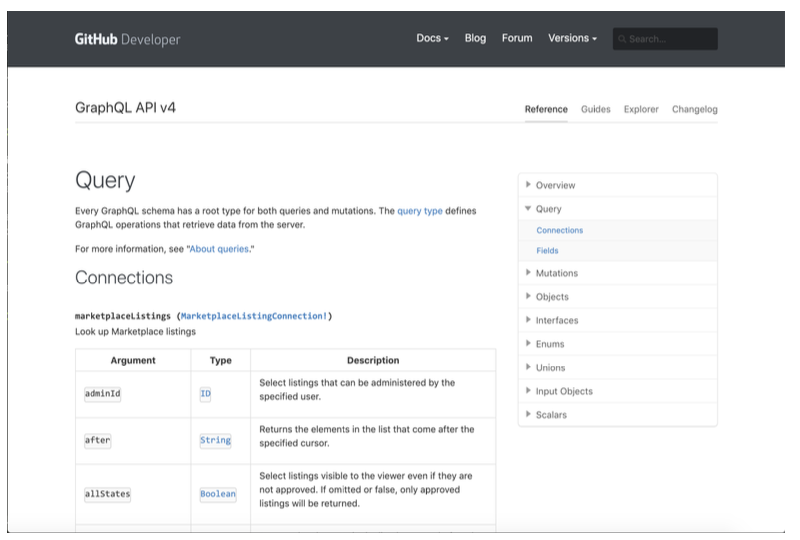
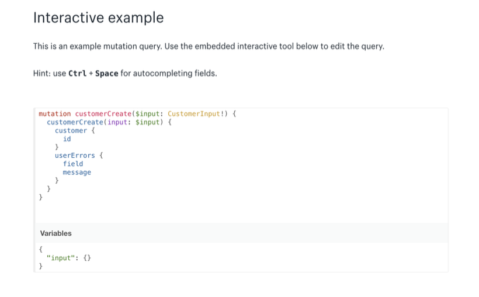

# Documenting GraphQL APIs

ドキュメンテーションは、あなたのAPIとの統合を望むすべての新しい開発者にとっての入り口です。
私たちのAPIが利用され、愛されることを望むのであれば、優れたドキュメントに投資する以外に選択肢はありません。
あなたのドキュメントは、潜在的な顧客に物事を実現する方法を示すだけでなく、彼らがあなたのAPIを使って何を実現できるかを示す。
これは、多くのプロバイダが開発者向けドキュメントを作成する際に忘れている本当に重要なポイントだ。
この章では、GraphQLドキュメントの現状、既存のツール、優れたドキュメントを作成する方法について掘り下げていきます。

## Documentation Generators

ドキュメント生成ツール
ドキュメンテーションはGraphQLを使用する利点としてよく挙げられます。
GraphQLの型システムとイントロスペクション機能は、クライアントが可能性を発見することを容易にします。
これこそがGraphQLをGraphQL APIを探索するための強力なツールにしているのです。
このイントロスペクションと型システムは、GraphQL APIプロバイダーがドキュメントを生成するためにすぐに使用したものです。
多くのツールはイントロスペクションを使用して、クライアントが利用できるすべての型とフィールドの完全なリファレンスを生成します。
次の画像は、GitHubの開発者向けドキュメントにあるQueryルートのリファレンスです：

ジェネレーターはパイプラインに組み込むことができるため、GraphQLスキーマに変更を加えるたびに、その変更がすぐに次のパイプラインに反映される。
ドキュメントサイトにすぐに反映されるからです。
これにより、実装が変更されたためにドキュメントに誤った情報が表示されたり、チームが忘れてしまったために特定のユースケースがドキュメント化されなかったりする、APIでよくある問題が解決されます。

スキーマファーストアプローチを使うにせよ、コードファーストアプローチを使うにせよ、ジェネレーターツールで使う前にスキーマをフィルタリングする必要があるかもしれません。
というのも、@featureFlag、@preview、@internalのようなディレクティブや、内部だけの情報は決して外部のドキュメントに表示すべきではないからだ。
APIが内部だけのものであれば、このような心配はあまりないかもしれませんが、 ドキュメントサイトで自動的に情報を公開する前に、 その情報をイントロスペクションからホワイトリストに登録するのは常に良いアイデアです。
ひとつは内部開発者を支援するためのスキーマの全容を示すもので、 もうひとつはドキュメント作成ツールで使用することを目的としたものです。
スキーマからドキュメントを生成する方法は、すでにさまざまなものがある。
graphql-docs は、GitHub で使用して成功しているすばらしいツールである。
graphql-voyager のような他のツールでは、スキーマの視覚的な表現を生成することができます。
時間が経つにつれて、GraphQLドキュメンテーションのためのSaaSも増えていくことでしょう。

## The What, Not Just the How(何を、どのようにではなく)

GraphQL APIは、GraphQLの型システムのおかげで、またイントロスペクションからリファレンスを生成するのがいかに簡単であるかという理由で、素晴らしいドキュメントを持つものとしてタグ付けされてきましたが、実際に必要なのはそれだけなのでしょうか？
ある意味、とても簡単に始められるという事実は、祝福よりもむしろ呪いのようなものかもしれません。
これを理解するには、GraphQLの利点を説明するためによく使われる例、ハンバーガーの例えを使うのが一番かもしれません。
レストランでおいしいハンバーガーが食べたくなったとします。
一般的なエンドポイントベースのAPIは、一般的なユースケースを満たすためにあらかじめ作られたハンバーガーのリストを提供しますが、GraphQLは単にハンバーガーを作ることができる材料のリストを提供するという例えです。
当初、これはGraphQLの素晴らしい利点のように聞こえますが（実際そうです）、GraphQL APIを文書化することがいかに難しいかを示しています。

巨大な食材のリストが与えられたとき、潜在的なインテグレーターにとって、APIで何が実現可能かを理解することさえ非常に困難です。
典型的なエンドポイントベースのAPIは一般的に、明確に定義されたエンドポイントに特定のユースケースをグループ化するが、インテグレーターは現在、独自のリソースを構築するために多くのフィールドと引数をミックス＆マッチしなければならない。
悪いニュースは、ほとんどのGraphQLのドキュメントが、現在、フィールドの袋のように見え、それらを使って何をすべきかの本当の説明がないことです。

これを解決するためには、単にリファレンスを作成するのではなく、ユースケースに焦点を当てる必要がある。
リファレンスはドキュメントの非常に有用な部分だが、それだけではないはずだ。
知っているGraphQL APIのドキュメントウェブサイトをチェックしてみよう。
そのAPIで実現できることや、一般的な使用例について書かれているだろうか？ケースについて書かれているだろうか？
それとも、遊び場（GraphQL）と型やフィールドの膨大なリファレンスを提供しているだけだろうか？

私がGraphQLのドキュメントで一番嫌いなのは、プロバイダーがGraphQLの型の種類ごとに型を列挙している場合だ： 
オブジェクト型はこちら、入力型はこちら、ユニオン型はこちらです。
これはあなたのAPIと統合しようとしているクライアントにとっては全く役に立たない。
入力タイプは単独で使用されることはなく、例えばオブジェクトタイプを返す変異の入力として必要になります。
我々が興味があるのは、商品をカートに追加する方法であって、AddProductToCartInputの入力フィールドの完全なリストではない。
これらの例を考えると、RESTと比較してGraphQLではドキュメンテーションが大きな利点であると主張する人がいるのはおかしいと思います。
リファレンスは生成しやすいかもしれませんが、残りのドキュメンテーションを構築するのは非常に難しいままです。
ではどうすればいいのでしょうか？

## Workflows and Use Cases(ワークフローと使用例)

優れたGraphQLドキュメント、そして一般的なドキュメントは、単純なリファレンスにとどまらず、ユースケースや一般的なワークフローを考えることから始まります。
eコマースAPIを例にとってみましょう。
さまざまなレベルで考えることができます：

1. タイプ、フィールド、引数： 単純なリファレンス
2. 機能/ユースケース： カートに商品を追加する。
注文のキャンセルなど。
3. 一般的なアプリケーションとワークフロー： APIを使って何が作れるか？

チェックアウトの拡張機能の構築、注文後の自動化の構築など。
私は、最高のドキュメントは3つのレベルすべてを含むべきだと考えています。
典型的なワークフローと可能性に焦点を当てたドキュメントの素晴らしい例は、MicrosoftのGraph APIだ（GraphQL APIではないのでわかりにくいだろうが）。
このAPIのドキュメントページには、"See what you can do with Microsoft Graph "というセクションがあり、ユーザーがAPIを使うことで何を達成できるかを強調している。
そして、GraphQL APIは、ユースケースや可能性がフィールドやタイプの海の中で見失われることがあるので、このことに特別な注意を払うべきである。

これらのプラクティスは簡単に自動化できるものではない。
これらの文書化プラクティスのほとんどを確実にカバーする最善の方法は、文書化が後回しにならないようにすることでしょう。
設計の最初の段階でテクニカル・ライターを参加させ、全過程で複数のチームや人を巻き込みましょう。プロセスに沿って、ユースケースを考える。
GraphQL API 用の単純なドキュメント生成ツール以上のものに挑戦してください。
ユーザーが満足するだけでなく、APIデザインも同時に改善されるでしょう。

## Example / Pre-Made Queries(クエリー例)

「ここにすべての材料があるので、それに対処してください」という問題を少し解決する現実的な方法は、インテグレーターのためにあらかじめクエリーを構築しておくことである。
これにより、インテグレーターは素早く統合し、必要に応じてクエリを微調整することができる。
組み込みのGraphQLは、これらのクエリ例を公開し、ユーザーがニーズに合わせて特定のフィールドを調整できるようにする素晴らしい方法だ。
例えばShopifyは、彼らの変異のドキュメンテーションのために素晴らしい仕事をしている。

## Changelogs(変更履歴)

ChangelogはAPIクライアントがあなたのAPIの変更点を見たり、購読したりするための素晴らしい方法だ。
一般的なアプローチは、バージョン間の変更点のリストを作成することですが、継続的な進化を選択する場合にも絶対に使用できます。

GraphQL特有の変更ログの良い例は、GitHub GraphQL APIの変更ログで、このために私が書いたツールであるgraphql-schema_comparatorを使って生成されます。
Shopify と Stripe は、API プラットフォームの変更ログの他の素晴らしい例です。

## Upcoming Changes(今後の変更点)

チェンジログは素晴らしいもので、すでに行われた変更のログを記録するだけでなく、今後の変更を計画することでアップグレードすることができます。
バージョン管理に関する前の章で説明したように、コミュニケーションは変更を成功させるための大きな要素です。
GitHub では、API クライアントのために特別な変更ログを作成しました。

また、アプリケーションの実行時の動作に影響を与える可能性のある変更については危険、スキーマを破壊する変更については破壊というように、すべての変更をその重大性に基づいて分類している。

## Summary

- GraphQLドキュメント・ジェネレーターはAPIリファレンスとしては素晴らしいが、人間味に欠ける。
- ドキュメンテーションは、APIで何が可能なのかに焦点を当てるべきであり、それを実現する方法だけに焦点を当てるべきではありません。
- Changelogと今後の変更ページは、クライアントがAPIの進化に追いつくための素晴らしい方法です。

