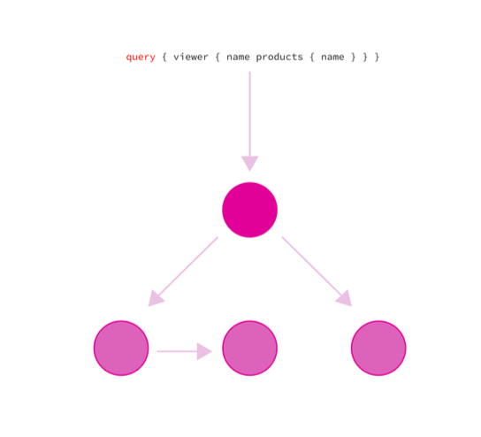
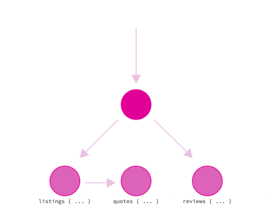
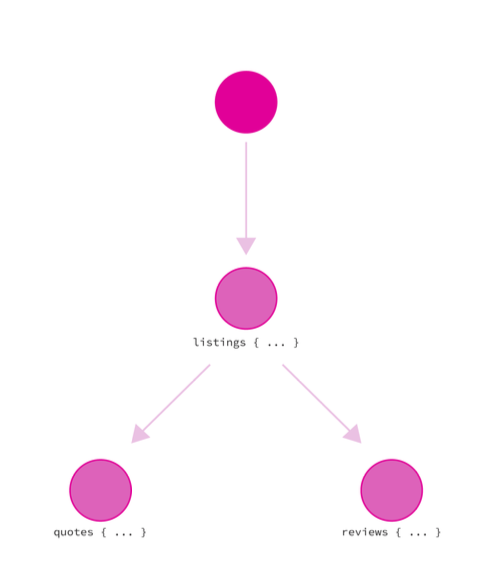
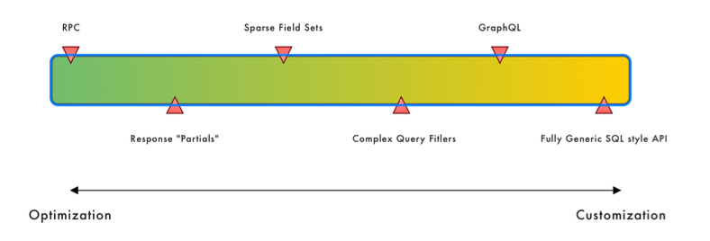

# GraphQL in a Distributed Architecture

この章では、GraphQLにまつわるさまざまな一般的な分散アーキテクチャと戦略について見ていきます。
過去数年間、GraphQLはモノリシックなAPIレイヤーに由来する一方で、サービス指向アーキテクチャのようなさまざまなコンテキストで使用されてきました。

## GraphQL API Gateway

GraphQLはAPIゲートウェイのパターンに非常に素早く適用された。
APIゲートウェイは通常、エクスペリエンス／機能へのエントリーポイントとして機能するサービスである。
クライアントが興味を持ち、消費しているユースケースを、これらのユースケースに関わる基礎的なサービスから切り離すために、分散アーキテクチャでよく見られる。
エントリーポイントはユースケースの実装の詳細を隠すことを目的としているため、クライアントはある機能の背後にいくつの「サービス」があるのかを知る必要はない。
ゲートウェイによって、プロバイダーは安定したファサードを維持しながら、これらの詳細を時とともに変更することができる。

プロバイダーはまた、全てのAPIサーバーに同じロジックを実装する代わりに、レート制限や認証のような多くのロジックを統一することができる。
より複雑なAPIゲートウェイの中には、個々のサービスへの複数の呼び出しを1つのリクエストに集約できるものもある。
その意味で、GraphQLは既存のAPIを見事に抽象化し、これらの可能性を公開するスキーマと、クライアントが舞台裏で複数のソースから好きなようにユースケースを利用できるようにするクエリ言語を提供することができる。

APIゲートウェイには、ソリューションを分析する際に留意すべきいくつかの懸念事項がある。
まず1つ目は、ゲートウェイレベルで多くのことをやりすぎることがしばしば非常に誘惑的であるということだ。
そのせいで、APIゲートウェイはしばしば集中障害ポイントになり、集中コンフィギュレーションになり、個々のサービスがコントロールすべき懸念を扱うことになる。
結局のところ、ほとんどのチームがマイクロサービスに目を向ける理由は、そもそもこのロジックを分散化するためなのだ。
実際、理想的な世界では、私たちのAPIゲートウェイはおそらく、システム内のこの大きな集中ポイントではなく、単なる別のサービスに近いだろう（言うは易く行うは難し）。

GraphQL APIゲートウェイが特殊なのは、通常、異なる典型的なHTTPリソースを扱う場合ほど単純ではないということだ。
エンドポイントベースのAPIを扱うAPIゲートウェイの多くは、単純なプロキシのように動作する。

[画像](img/156p.png)

上記の例では、APIゲートウェイは適切なサービスを呼び出すことで/usersエンドポイントを解決し、別のサービスを呼び出すことで/productsリソースを解決する。
実装の面ではプロキシと比較されるが、概念的にはAPIゲートウェイは単なるプロキシであってはならない。
なぜなら、それはゲートウェイが基礎となる実装と非常に結合していることを意味するからだ。

GraphQLでは、クエリはしばしば1つの固有の基礎となるサービスを通して解決することができず、フィールドは複数のサービスにまたがってクエリを実行している可能性があります。
クエリがより大きく複雑になると、GraphQLゲートウェイはこの情報をフェッチするために複雑なプランをオーケストレーションしなければならないことが想像できます：



単純なケースは、エンドポイントベースのAPIでより一般的であると言うことが重要である。
例えば、ゲートウェイが異なるリクエストを一緒に組み合わせたり、基礎となるサービス表現に変換を行ったりし始めると、同じ問題のいくつかが発生する。
GraphQLは単純にその問題をさらによく示している。
私たちのドメイン上でGraphQLインターフェースを提供することにはまだ多くの価値があります。
次の数セクションでは、GraphQLゲートウェイを構築する際に最も一般的なソリューションを探ります。
さまざまなアプローチを取り上げるので、優れたAPIゲートウェイとはどのようなものなのか、避けるべき一般的な落とし穴はどのようなものなのかを覚えておくとよいだろう。
それでは、いくつかの実装を取り上げよう。

## The “Simple” Way

ユースケースに対するシンプルな「プロキシ」解決は、そのシンプルさゆえに魅力的であり、GraphQLクエリはしばしば複数の担当領域やサービスにまたがる傾向がありますが、それは必ずしも難しいルールではなく、スキーマの設計方法によってクエリの実行をシンプルにすることができます。
実際、私が初めてGraphQLをゲートウェイとして使用する組織を見たのは、おそらくAirbnbのブログ投稿からでした。
Airbnbはユースケース用に既存のThriftスキーマを持っており、異なるプレゼンテーションサービスに分かれていました。
これらのユースケースを統合されたGraphQLインターフェイスとして公開するために、彼らはThriftインターフェイスをGraphQLスキーマに変換し、ゲートウェイにとって実行がより簡単になるように単純にマージしました。
ブログ記事のクエリを見てみよう：

```gql
query LuxuryHomeQuery {
  luxuryHome {
    listings: luxuryListingsById(listingId: 123) {
      id
      bathrooms
      bedrooms
    }
    reviews: reviewsByListingId(listingId: 123) {
      // ...
    }
    quote: luxuryListingQuote(listingId: 123) {
      // ...
    }
  }
}
```

このクエリでは、1 つの listingId に関連する 3 つの異なる概念、リスト、レビュー、および引用をフェッチしています： 123を毎回提供しなければならないことです。一般的なGraphQLサーバーがこのユースケースをどのように設計するかを比較してみましょう：

```gql
query LuxuryHomeQuery {
  luxuryListings(id: 123) {
    id
    bathrooms
    bedrooms
    reviews {
      // ...
    }
    quote {
      // ...
    }
  }
}
```

GraphQLは、特定のノードからリレーションシップをフェッチするのに優れている。
なぜAirbnbはスキーマを典型的な、よりRPC的なエンドポイントに近い形で設計することにしたのでしょうか？
彼らの投稿では、その理由についてはあまり語られていないが、最初のケースでは、ゲートウェイの実行プランが2番目のケースよりもはるかにシンプルであることがわかる。

Airbnbのアプローチで想像できること 単純なプロキシ・アプローチと同じように、クエリの一部を基礎となるサービス間で簡単に分離することができる：



もしスキーマをより "純粋なGraphQL "方法で設計することを選択した場合、クエリに対してより複雑な実行プランを処理しなければならなくなる。
リスティングのフェッチを担当するサービスは、レビューと見積もりをフェッチするためにクエリの残りの部分を理解する必要があります。どちらの場合も、処理することが多くなります：



このアプローチの欠点は、宣言的なGraphQLクエリー言語の美しさの一部を間違いなく失い、より「バッチリクエスト」のように見えるものに戻ってしまうことだ。
この方法の利点は、APIゲートウェイがシンプルなままで、ダウンストリームのサービスとあまり連係せずに済むことだ。
ゲートウェイは、スキーマの異なる部分を単純に "配線 "するだけだ。

## Schema Stitching

APIゲートウェイを形成するために異なるスキーマを一緒に配線するAirbnbのアプローチは、一般的に "スキーマステッチ "と呼ばれ、GraphQLスキーマの2つ以上の部分を取り、有効でユニークなGraphQLスキーマを作るためにそれらを組み合わせる行為である。例えば、2つのサービスがスキーマの一部を定義することができます：

```gql
# User Service Schema
type Query {
  user(id: ID!): User
}
type User {
  name: String!
  age: Int!
}
```

```gql
# Product Service Schema
type Query {
  product(id: ID!): Product
}
type Product {
  name: String!
  price: Int!
}
```

スキーマのスティッチングは、この2つのスキーマを1つに統合する：

```gql
type Query {
  user(id: ID!): User
  product(id: ID!): Product
}
type User {
  name: String!
  age: Int!
}
type Product {
  name: String!
  price: Int!
}
```
見てわかるように、型は同じスキーマの下でマージされ、共有型（この例ではQueryのような）はフィールドをマージした。
この例は、直前に取り上げたAirbnbの例に非常に似ている。
ゲートウェイがクエリを見て、どのサービスがそれを解決すべきかを確認するのは非常に簡単だからだ。
サービス間の型の依存関係はありません。
ここで、あるユーザーが販売している商品を問い合わせたいとします。
を照会したいとします。
次のようにスキーマを変更する必要があります：

```gql
# User Service Schema
type Query {
  user(id: ID!): User
}
type User {
  name: String!
  age: Int!
  productsForSale: [Product]!
}
```
早速、問題があることに気づく。ユーザーサービスのスキーマはProduct型を使っているので無効です。
スキーマをつなぎ合わせて初めて有効になります。
このような型依存の問題を解決するために、スキーマのステッチングは通常ゲートウェイレベルで行われ、スキーマを組み合わせますが、スキーマ間のリンクも追加します。
Apolloスキーマステッチングを使用すると、ロジックは次のようになります：

```gql
const linkTypeDefs = `
  extend type User {
    productsForSale: [Product]!
  }
  extend type Product {
    owner: User!
} `;
mergeSchemas({
  schemas: [
    productSchema,
    userSchema,
    linkTypeDefs,
], });
```

UserタイプにproductsForSaleフィールドを追加しましたが、どのように解決するのでしょうか？
ユーザオブジェクトを取得し、残りのクエリを商品サービスに問い合わせる解決ロジックを記述する必要があります。
Apolloのソリューションを使用すると、次のようになります：

```gql
const mergedSchema = mergeSchemas({
  schemas: [
    userSchema,
    productSchema,
    linkTypeDefs,
  ],
  resolvers: {
    User: {
      productsForSale: {
        fragment: `... on User { id }`,
        resolve(user, args, context, info) {
          return info.mergeInfo.delegateToSchema({
            schema: productSchema,
            operation: 'query',
            fieldName: 'productsByUserID',
            args: {
              ownerId: user.id,
            },
              context,
              info,
            }
          );
        },
      },
    },
    Product: {
      owner: {
        fragment: `... on Product { ownerId }`,
        resolve(product, args, context, info) {
          return info.mergeInfo.delegateToSchema({
            schema: authorSchema,
            operation: 'query',
            fieldName: 'user',
            args: {
              id: product.ownerId,
            },
            context,
            info,
          }); 
        },
      },
    },
  },
});
```
このアプローチには多くの問題があり、最終的にアポロはスキーマステッチを非推奨とした：

- ゲートウェイは、基盤となるサービスについてはできるだけ知るべきではないという話をした。ゲートウェイは薄いレイヤーであるべきだ。この場合、リレーションシップを定義し、それらがどのように解決されるかを処理しなければならない。私たちはこれらのことを分散化したかったのですが、現在ではクロスサービス・クエリーのロジックはすべてゲートウェイに集約されています。
- ゲートウェイのロジックは非常にもろく、名前の競合などを処理し、基盤となるサービスがスキーマを変更しないようにする必要がある。

## Apollo’s Schema Federation

スキーマ・フェデレーションは、スキーマ・ステッチングに取って代わることを目的としてApolloがリリースした製品だ。どのように機能するかは詳しく説明しないが、スキーマのステッチング・アプローチの落とし穴を回避することを目的としている。フェデレーションは、個々のサービスに独自のスキーマと、他のサービスを拡張する方法を定義させることで、スキーマの完全な分散化を目指し、ゲートウェイで定義されたリンクとビジネスロジックの必要性を排除する。これを実現するために、フェデレーションは、フェデレートするゲートウェイが「クエリプラン」を構築することで、サービス間のクエリを解決できるように、型に注釈を付けられる仕様になっています。


スキーマフェデレーションのようなアプローチを選択する場合、注意すべき点がいくつかあります。第5章で取り上げたように、モノリシックなGraphQLサーバーであっても、予測可能なパフォーマンスは常に課題です。今、私たちはクエリプランを扱っていますが、これはコントロールとチューニングが難しいことで悪名高いものです。デバッグが非常に難しいブラックボックスになりかねません。それを簡単にするのは、実装とツール次第だ。もうひとつは、フェデレーションが機能するためには、すべてのサービスがフェデレーション仕様を実装する必要があるということだ。

もし私がプロジェクトでスキーマ・フェデレーションを使うとしたら、いくつかのことに気をつけるようにする：

1. 基礎となるサービスが、フェデレイテッド・グラフの適切な分割になっていない可能性がある。ユースケースは複数のサービスにまたがることがあるため、サービスの分割方法ではなく、ユースケースとサブドメインでグラフを分割することを目指すべきだろう。100のサービスがあったとしても、必ずしも100の別々のスキーマが必要というわけではありません。
2. スキーマ間の "リンク "は、独断的なパフォーマンスを避けるため、できるだけシンプルに保つ。
3. この仕様の最も成熟した（そして独創的な）実装はJavaScriptである。現時点では、Federationは、JavaScriptサービスを構築する気があるか、すでに持っている場合に最も効果的です。さらに多くの言語が追加される予定なので、注目してほしい。

そう考えると、フェデレーションは、チームのニーズに合っていて、スキーマステッチよりも拡張性が高ければ、美しいソリューションになり得る。Apolloチームには莫大な GraphQLに関する膨大な知識と経験があり、おそらくクエリプランニングを改良し続け、ブラックボックスでなくしていくだろう。

## Single Schema Gateway

全体として、ステッチングとフェデレーションに関するほとんどの問題は、GraphQLが本質的にAPIへの集中型アプローチであるという事実に起因しています。
私たちは望むだけ分散化を試みることができますが、現実には、非常に複雑なゲートウェイを通して、または単一のGraphQLサーバーを構築することによって、依然として集中化に行き着きます。
私は、GraphQLは単一のスキーマと薄いAPIサーバーとして、マイクロサービスの文脈で場所を持つことができると心から信じている。

もし私たちがGraphQL APIを "単なる別のサービス "であり、そもそもゲートウェイに求めていたものだと考えたらどうなるだろうか？
物事を退屈でシンプルに保ちたいのであれば、グラフを単一の場所に保ちつつ、多くの基礎となるサービスによって解決されるGraphQL APIサーバーを構築することができる。

フェデレーションやステッチングのようなものを選ぶとき、私たちは組織の複雑さと運用の複雑さを交換することになる。
どちらのアプローチも有効だ。Facebook、GitHub、Shopifyはすべてモノリシックなスキーマを運用しており、異なるリポジトリでグラフを分離するのではなく、優れた開発者ツールを構築することで組織の問題にアプローチしている。

今日、GraphQLゲートウェイを構築するための私の好ましいアプローチは、おそらく単一のサービスとして動作する薄いGraphQLファサードだろう。
GraphQL APIは、ステッチングやフェデレーションのような複雑なアプローチを必ずしも使用しなくても、ゲートウェイとして機能することができる。
スキーマとインターフェースは一元化したまま、実行（リゾルバ）はフェデレーションさせることができる。
注意しなければならないのは、ビジネスロジックをゲートウェイ自体からほとんど完全に切り離すことだ。
このアプローチは、既存のアーキテクチャーを持つチームにとって段階的に採用しやすいと思うので、私はとても気に入っている。
多くの組織では、RESTやgRPCのような他のアプローチを使ったサービス・コミュニケーションがすでに行われている。
ステッチングやフェデレーションが現在要求しているように、すべてのサービスにGraphQL APIを実装する必要があるのではなく、この方法でGraphQLを構築する際にこれらの部分を再利用するのは簡単です。

しかし、ステッチングやフェデレーションとは異なり、ここで説明するような成熟したGraphQLゲートウェイの実装は存在しない。
これまでこの本で取り上げてきたことのほとんどに従うことで、私たちはすでに必要なもののほとんどを持っています。
GraphQLのようなものでは、物事を退屈でシンプルに保つことは、実はとても良いことなのです！


サービス指向アーキテクチャとスキーマ・フェデレーションの背後にある考え方のひとつは、ソフトウェアを開発する際にチームを切り離すことだ。
スキーマのフェデレーションは、異なるチームがそれぞれの側でスキーマを進化させることを意味するが、ゲートウェイがこれらのすべてを単一のAPIの下に統合することを可能にする。

コードベースが小さくなることで、チームがスキーマの変更をより迅速に行えるようになるかもしれないが、最終的には中央集権的なグラフとやりとりしていることに変わりはないことを忘れてはならない。
このような問題は、スキーマのコア部分で対処しなければならない。
チームが適切な名前を付け、汎用的な型を再利用しないようにすることである。
命名の衝突は、スキーマをマージしようとするときによく起こる。
これはたいてい、そもそもの命名が適切でないために起こる症状だ。

関心事の分離と名前空間は、単一のコードベースでスキーマを構築する場合でも、多くのコードベースでスキーマを連携させる場合でも、ベストプラクティスとツールで対処できることだ。
私が推奨するのは、チームが概念に適切な名前を付けられるようにリントとベストプラクティスを使うこと、そしてスキーマの一部を切り離すためにプログラミング言語が提供するツールを使うことだ。

## GraphQL as a BFF

第1章の序章で「フロントエンドのためのバックエンド」パターンについて述べたが、GraphQLが同じ問題のいくつかに対処することを目指していることも説明した。
私たちはGraphQLをある種の親友として比較さえした。
さらに深く掘り下げてみよう。
BFFとはいったい何なのか？
BFFはある種のAPIゲートウェイと考えることができる。

BFFパターンの核心は、OSFA（One-Size-Fits-All）APIを構築する際に現れる可能性のある一般的な問題に対するSoundCloudからの回答です。
OSFA APIでは、多くの異なるクライアントアプリケーションがサーバー側のリソースを共有しなければならないことが多く、バックエンドのユースケースから発展した問題や、クライアントの視点からの質の低いエクスペリエンスにつながる可能性がある。

BFFパターンでは、クライアント間の違いを認め、クライアントや経験ごとに個別のAPIサーバーを構築することを選択する。
これらのサーバーは、クライアントのニーズにより特化し、リソースを共有しようとするときに直面する問題なしに自由に進化することができる。
しかし、BFFパターンは技術的な選択だけではなく、しばしば組織的な選択でもある。
特定の "エクスペリエンス "を担当するチーム、例えばモバイルチームは、そのAPIとクライアントを完全にコントロールすることができ、OSFA APIでしばしば発生する組織的な問題やコミュニケーションの問題を回避することができる。
これらの問題は様々な方法で解決可能だが、BFFパターンは単に問題解決にこのような意見的スタンスを取るだけであることに注意されたい。

これを読むと、GraphQL APIの利点といくつかの類似点を見出すことができる。
GraphQLでは、フィールドを追加しても既存のクライアントには影響がないため、進化が少し近づきやすくなり、1つのサーバーで多くの異なるクライアントをサポートできるようになる。
しかし、クライアントが自分のニーズを宣言的に選択する必要があるという事実のほかに、GraphQLが本質的にBFFとして良い代替物や類似のソリューションになるようなものはありません。
実際、私たちがGraphQLサーバーを構築する方法は、OSFA GraphQL APIになる可能性もある。

もうひとつ注意しなければならないのは、BFFは単にクライアントのユースケースを表現面で最適化するだけにとどまらないということだ。
BFFは、ペイロードを異なる方法でシリアライズしたり、異なる方法でキャッシュしたり、別の方法で認証したりすることを決定するかもしれません。
本当に「GraphQL BFF」パターンを持つには、おそらく複数のGraphQLサーバーが必要になるでしょう。
を実装しているにすぎない。

それでも、GraphQLサーバーは間違いなく、1つのサーバー内で複数のクライアントのニーズを最適化するために使用することができ、これは信じられないほど便利である。その際、留意すべき点がある：

- GraphQLの "BFF "は、似たようなことを実現する複数の異なる方法を追加することを恐れる必要はない。これはクライアント固有のフィールドを追加することであり、必要であればまったく異なるタイプを追加することでさえある。この優れた点は、既存のクライアントがまったく影響を受けないことだ。難点は、スキーマがさらに "肥大化 "して文書化され、ディスカバリーが影響を受ける可能性があることだ。
- 汎用的なOSFA GraphQL APIを構築する誘惑は避けなければならない。
- 独立性はツールや文化によって達成されなければならない。
パターンによって達成されなければならない。

もうひとつ注意すべきことは、BFFパターンに共通する問題は、共有された懸念事項であるということだ。
これは、複数のエクスペリエンスに最適化できるという点で、単一のGraphQLサーバーを維持することの利点の1つである。
同じ認証システム、レート制限ロジック、認可システムなどを再利用することができます。
しかし、先に説明したように、これは利点と同様に欠点とも言えます。
これは文脈に大きく依存する。

全体として、GraphQLは間違いなく単一のBFFとして使用することができ、リソースの表現に関して複数のクライアント体験をサポートするために採用することができます。
しかし、BFFパターンの主な目標である、それらのエクスペリエンスの完全な自律性は、本来より分離され独立している複数のBFFサーバーよりも積極的に維持されなければなりません。

## Service Communication

この章ですでに取り上げたように、GraphQLは、私たちのシステムへのインターフェースとして、南北のトラフィックにAPIを提供するという点で、素晴らしい選択肢となり得る。
しかし、"東西 "の方法でサービス間の通信にGraphQLを使用するのは良い考えでしょうか？
まず、優れたサービス間通信の要件を見てみましょう。


ネットワーク境界は、独立したスケーリング、可用性、開発スピードなど、多くの理由で非常に有用である。
これらはすべて、サービス指向アーキテクチャを選択した人たちがいる正当な理由だ。
しかし、非常に高速なメソッド呼び出しからネットワーク呼び出しに移行すると、多くのオーバーヘッドが発生する。
そのため、サービス間通信を考えている人にとっての最初の目標の1つは、このオーバーヘッドをできるだけ減らすことである。
このため、通信用のプロトコル／アーキテクチャを選択する際には、パフォーマンスがかなり重要になる。

もうひとつ注意しなければならないのは、（ネットワークを介した）リモートコールはローカルコール（メソッドコール）とは本質的に異なるということだ。通常 は非常に異なる設計を必要とする。幸いなことに、最近利用可能な技術の選択肢のほとんどで、APIの設計に注意さえすれば、リモートコールを可能にする方法でAPIを設計することができる。これはまた、弾力性について考え、ネットワークを抽象化しすぎるのを控える必要があることを意味する。裏側でネットワークコールを行ったり、気づかないうちに非効率的なことをしてしまわないようにするためだ。

APIの進化も大きな問題だ。あるサービスのAPIに追加されたフィールドが、システム内のすべてのクライアントに変更を要求するようなことは避けたい。
拡張のみの型はとても便利だ。ロックステップのデプロイを避けるのに役立つ。
今日、ほとんどのAPIソリューションはこのような特質を備えており、GraphQLもそのひとつだ。しかし、だからといってまだ特定のソリューションを指すわけではない。

もうひとつ見ておきたいのは、使用するプロトコルだ。
ほとんどのAPIはHTTP 1.1で実装されているため、ほとんどの人はGraphQLに難色を示す。
それは事実でしょうが、そうである必要はありません。
GraphQLは意図的にトランスポート／プロトコルにとらわれない。
H2上、UDP上、あるいは新しいGraphQL固有のプロトコルとしてGraphQLを実装することを妨げるものは何もありません。
しかし、反論としては、それはこれまで本当に試みられたことがなく、現在のGraphQL APIで私たちが慣れているいくつかのセマンティクス（200ステータスコード、ヘッダー）を変更するか、少なくとも適応させる必要がある可能性があるということです。
一般的に、サービス間通信でGraphQLを使用する強力なインセンティブがあれば、プロトコルやトランスポートレイヤーはほとんど問題ではないと考えたい。

GraphQLが最適かどうかを確認するために、GraphQLが得意とすることとトレードオフについて見てみよう。
これらのトレードオフを表現する一つの方法として、APIのカスタマイズスペクトルがある：



APIのスタイルが異なると、柔軟性と最適化のどちらかを選ばなければならないことが多い。
スタイルによっては、どちらか一方に偏っているものもある。
例えば、RPCは通常、非常に最適化された関数呼び出しであり、GraphQLはもう一方の極端にあり、クライアント側で多くの柔軟性を可能にする。

最適化された面では、我々には多くの利点がある：

- キャッシュの方が効果的
- サーバーサイドのパフォーマンスは通常より良くなる（最適化するものが1つしかないため）。
- 非常に明確な使用例。

しかし、デメリットもある：
- 本章で説明した "One-Size-Fits-All "の問題
- 大規模で汎用的なペイロードの場合、帯域幅と遅延が問題になる可能性がある

柔軟性やカスタマイズが可能な面では、すでに散々話してきたように、通常のGraphQLの利点がある：
- 帯域幅の節約。
- より多くのクライアントのユースケースをサポートしやすくなります。
- リソースの追加にかかるコストが少ない。

しかし、これには欠点もある：
- バックエンドの実行とパフォーマンスがより複雑。
- 使用例が明確でなく、焦点が絞られていない。

全体として、サービス通信はGraphQLの使用にとってスイートスポットではないと思う。
gRPCのようなRPCを意識したテクノロジーは、このようなユースケースのために作られました。

## Summary


GraphQLはAPIのための美しい抽象化であり、分散アーキテクチャで使用するのは魅力的だ。
GraphQLの実行は些細なことではなく、分散されたコンテキストでクエリを実行するとさらに複雑になる可能性が高いことを覚えておいてください。
もしあなたがサービス指向アーキテクチャを運用していて、GraphQL APIを公開しようとしているのであれば、これが私のおすすめだ：

1. ユースケースを解決するために基礎となるサービスと連携する、単一のスキーマとしてのGraphQL APIサービスの構築を検討する。可能な限りレイヤーを薄くし、ツールやベストプラクティスを通じて開発者のエクスペリエンスを向上させる。
2. Apolloのスティッチングアプローチは公式には非推奨とされているが、ある条件下ではまだ有効なアプローチだと思う。この章の前半で見たように、スキーマ間のネストされたリンクは維持するのが本当に面倒です。
3. クエリルートでのマージよりも複雑なものについては、Apollo Feder-ationは、インテリジェントなクエリプランナを持つゲートウェイにとって、現在のところ最良のアプローチです。

最後に、gRPCのようなサービス間の呼び出しには、より効果的な通信パターンがあり、GraphQLが与えてくれる利点は、その文脈ではあまり当てはまらないと思う。
